# What is cloud?

Cloud computing is a model for enabling ubiquitous, convenient, on-demand network access to a shared pool of configurable computing resources (for example, networks, servers, storage, applications, and services) that can be rapidly provisioned and released with minimal management effort or service provider interaction. This cloud model is composed of five essential characteristics, three service models, and four deployment models.

### 5 Essential Characteristics of Cloud

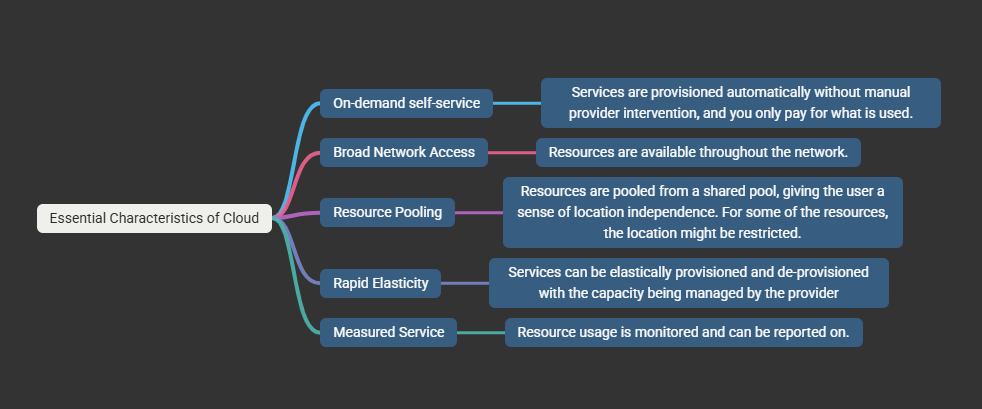

### 4 Deployment models of Cloud

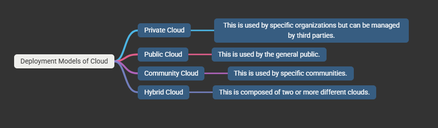

### Service Models of Cloud

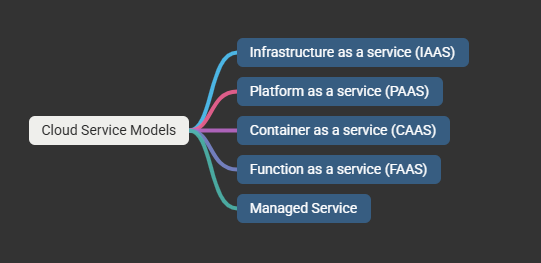

### How the Google Cloud is different from the other cloud providers.

### GCP Locations

GCP has a global footprint that includes North America, South America, Europe, Asia, and Australia. The locations are further split into regions and zones.
It is your decision where your application should be located to provide low latency and high availability.
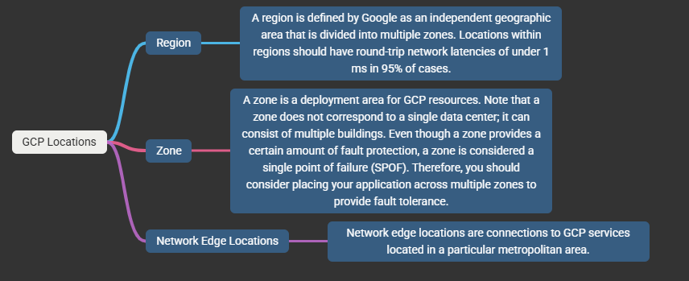

Note: for more information,
https://cloud.google.com/about/locations

It should also be noted that not all services are available in each region

### Resource Manager

- GCP consists of containers such as organizations, folders, and projects to hierarchically group your resources.
- The resources can be managed programmatically using APIs. Also, Google provides tools such as Google Cloud Console and command-line utilities, which are wrappers around the API calls.

  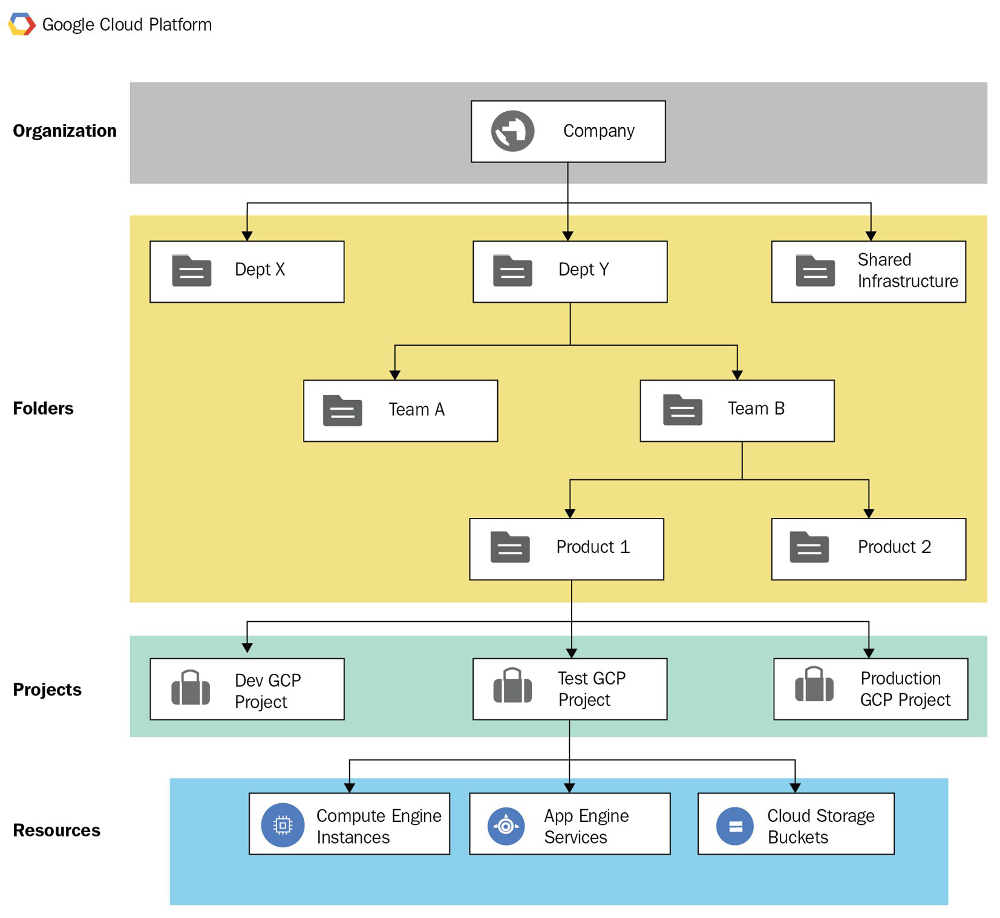

- Explanation:
  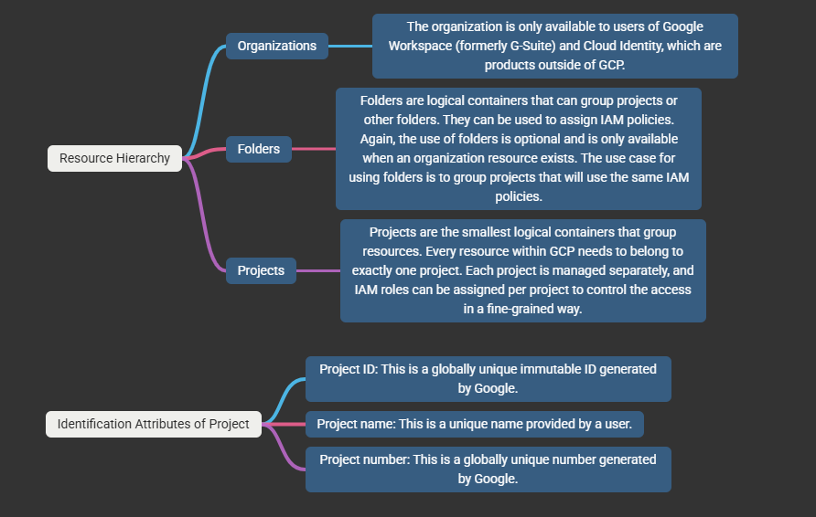

### Resource Scope's

- The resources can be either global, regional, or zonal.
- This indicates how accessible the resource is to other resources.
- For example, a global image can be used in any region to provision VMs. On the other hand, a VM that needs to belong to a particular subnet must reside in the same region for which the subnet was configured.
- Even though the resources have a narrow scope, bear in mind that they still need to have unique names within the project, meaning you can't have two VMs with the same name within one project.

## Global Resources

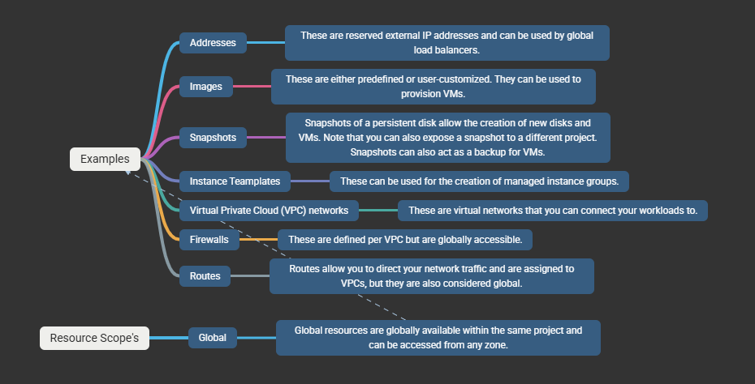

## Regional Resources

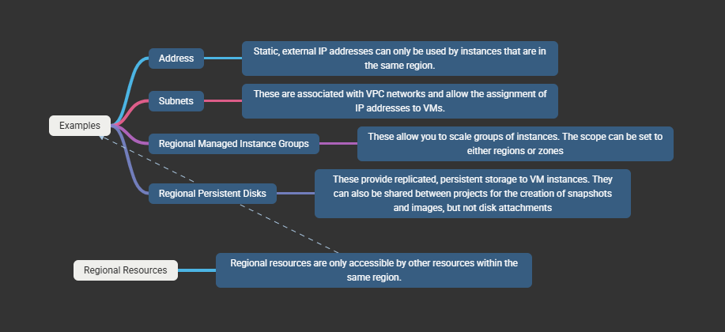

## Zonal Resources

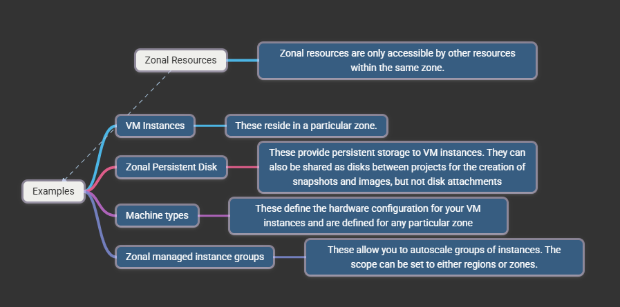

### Billing Accounts:

- Depending on your company structure, you might have different requirements regarding billing. With GCP, you have the option to create a single or multiple billing accounts.
- As shown in the following diagram, the billing accounts can be associated with one or more projects. The actual payment details are created in the payment profiles that are attached to the billing account.
  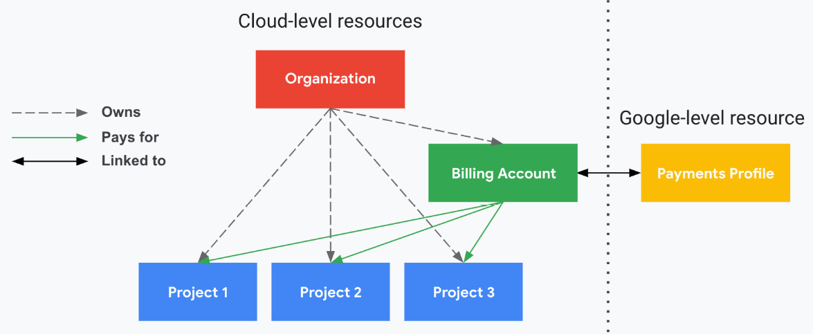
- A Cloud Billing account is set up in Google Cloud and defines who pays for a given set of Google Cloud resources and Google Maps Platform APIs
- A Cloud Billing account is connected to a Google payments profile. Your Google payments profile includes a payment method that costs are charged to.
- Access permissions for Cloud Billing and Google payments are configured in two different systems depending on what type of access you want to provide.
  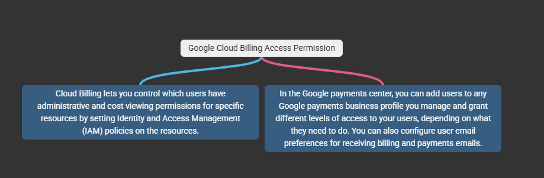

  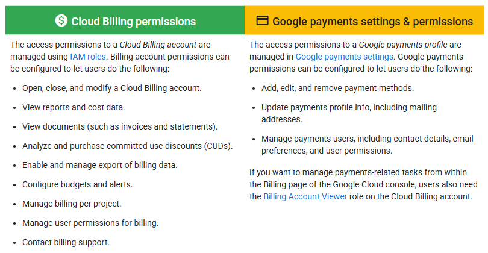

- Do you have multiple departments that need separate billing—for example, finance, engineering, and human resources—or do you manage it centrally?
  then : require multiple projects with a single billing account.

## Billing Account Management

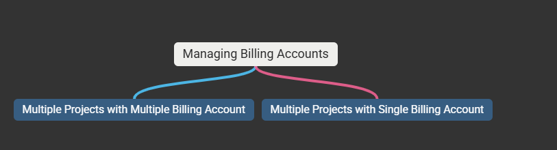

#### Multiple Billing Account

- Inside Billing, you need to select Manage Billing Account from drop down of Billing Account.

  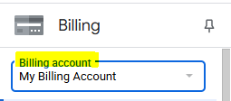

- After selecting the Manage Billing Account from the drop down, the new panel will appear at right side, to create multiple billing accounts.

  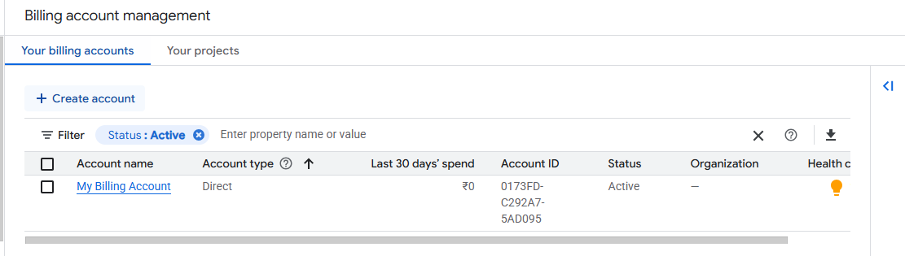

- The purpose of having multiple billing accounts, to manage multiple currencies as well as clients from different countries. Also you can maintain separate billing account for client and for your organization resources.

- Inside the same right side panel, there is an option called project along with
  your billing accounts, therefore, select your projects from right side.
  You can assign here the billing account to your projects by clicking on the 3 dots at extreme right side.
  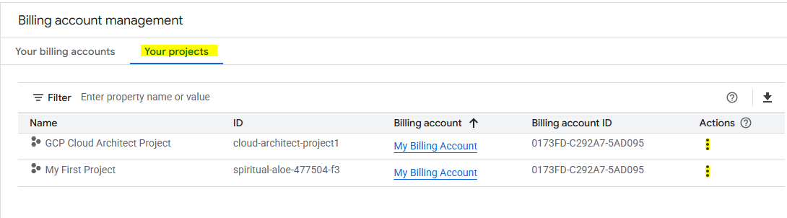

- While clicking on the change billing button, it will show the respective billing accounts and you've to select the billing account you want for a particular project.
  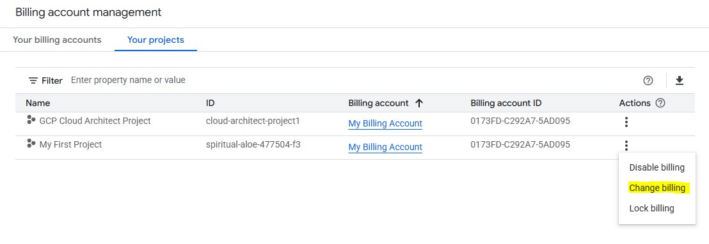

### Exporting Billing

GCP allows you to export the billing information to a BigQuery dataset. This can be useful if you need to prepare reports or carry out an analysis of the cost of your cloud consumption.

- BigQuery is a GCP data warehouse service.

# Creating Billboard

- Creating a billboard is a great task to achieve billing dashboard for billing account which has been attached to the multiple projects.

- Following are the steps to achieve billboard in GCP.

Step-1: Go to Google Cloud Console → Billing → Billing export

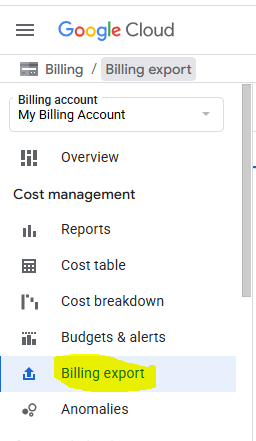

Step-2: Once clicked on the Billing Export button, in the right side panel
we have to edit settings for

1. Standard usage cost and
2. Detailed usage cost

then, We must select the project name and dataset name.
The Project Name: on which you want the billing dashboard.
Dataset Name: It always should be 'billing_export'

### Note: billing_export dataset name is provided by the Google cloud and which is also called as default billing dataset where all the related schema's and table's would be available in BigQuery after 5-10 minutes. If you put other name rather than billing_export then it will not create respective billing account related tables and schemas.

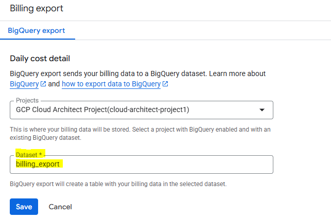

### After 10 mins you can check the automatically created billing_export related tables and schemas into the bigquery for respective dataset. Make sure you should select the proper Project Name (which has been given inside the Bigquery Export)

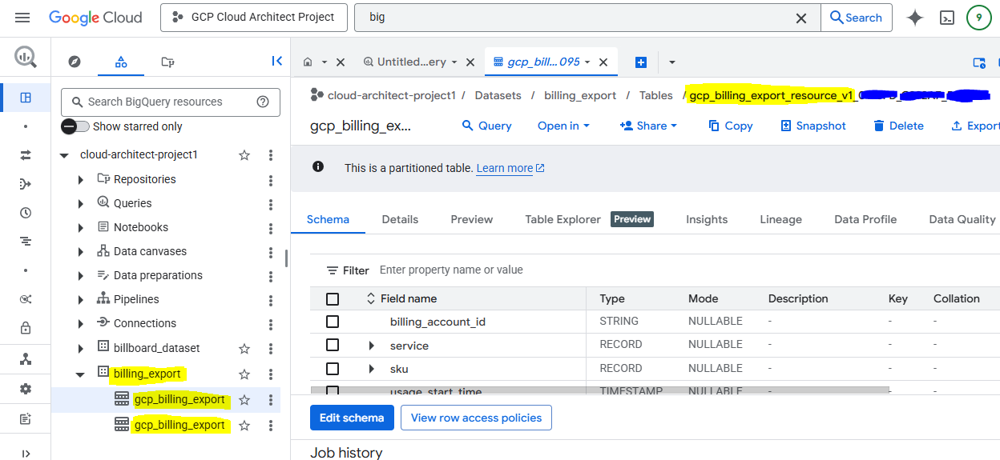

### The respective table name would be shown which is nothing but your Billing Account ID. The format would be as follows: cloud-architect-project1/Datasets/billing_export/tables/gcp_billing_export_resource_v1_XXXXXX_XXXXXX_XXXXXX

### Step-3 : Run your Terraform or Python steps from the following document:

URL : https://cloud.google.com/billing/docs/how-to/visualize-data#python

from above document
Select Python Section, is it your choice if you want to achieve it using terraform or python, but here we have chosen Python for the simple way using cloud shell.

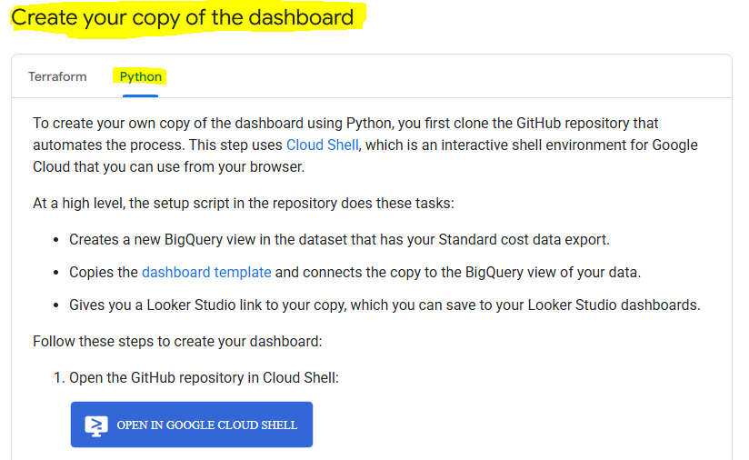

Follow each step carefully:

1. When you click on the step 1 for it will open the cloud shell of your current project and it will automatically download all the github repository in your home directory.

2. then, you've to naviagte to billboard directory:

   > $ cd examples/billboard

3. Run the following commands to set up the Python environment for the script:

> $ rm -rf bill-env
> python3 -m venv bill-env
> source bill-env/bin/activate
> pip install -r requirements.txt

4. Now, the main part, you've to provide a proper names in the below parameters because, it will throw an error if the proper names are not given and also keep in mind the parameters should be as it is (like -pr, -se, -bb)

python billboard.py \
 -pr 'cloud-architect-project1' \
 -se 'billing\*export' \
 -bb 'billboard_dataset'

### Very Important note here is that you've to provide the name billboard_dataset against -bb and after executing this command the respective dataset would be created in BigQuery. The name would be anything you want but it should not be as 'billing_export'

### After executing the python command you will get the URL for the Looker dashboard as follows:

https://lookerstudio.google.com/reporting/create?c.reportId=xxxxxx-xxxxxx-xxxx-xxxx-xxxxxx&r.reportName=MyBillboard&ds.ds8.refreshFields=false&ds.ds8.connector=bigQuery&ds.ds8.projectId=cloud-architect-project1&ds.ds8.type=TABLE&ds.ds8.datasetId=billboard_dataset&ds.ds8.tableId=billboard

### If you see any warning like below then just click on the acknowledge button because the dataset billboard_dataset is displayed after execution of the python command and the warning message is saying that it would be by default view to everyone those who access this report.

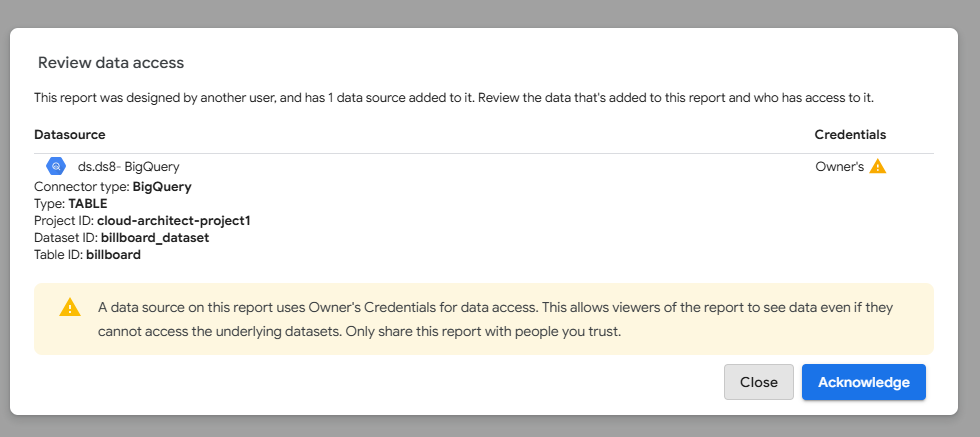

### Finally, a beautiful looker studio will be shown into the looker studio therefore, you can either access it using provided URL or from the following link: https://lookerstudio.google.com/ and you can also select the resources or biling project wise.

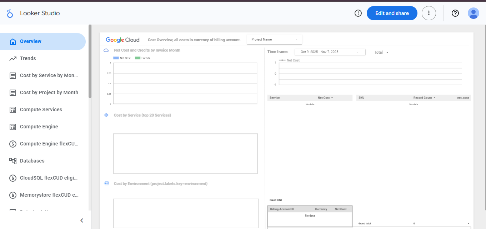
