# Google Cloud Core Services (High Level Overview)

### Google divides the services into the following logical groups

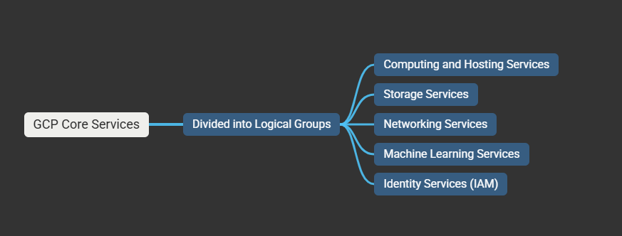

# 1. Computing and Hosting Services

- Depending on the user requirements and flexibility the cloud architect choose the services as follows.

  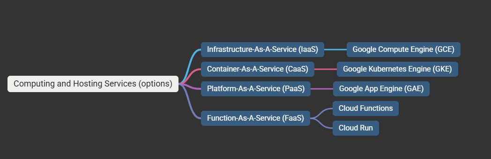

- GKE On-Prem is a GKE service that can be installed on your local environment and managed from your Google Console.
- Cloud Run is an FaaS offering that allows you to define containers that will listen for HTTP requests. This allows you to use languages that are not supported by Cloud Functions.
- Fully managed container platform: Cloud Run

## How to choose right resource?

- It depends upon several factors, for example
  - do we need full control over our infrastructure?
  - do we want fully managed service?

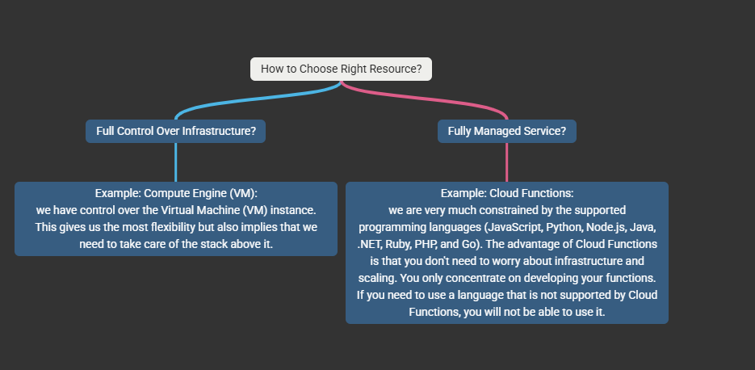

### The computing options in GCP is shown as follows:

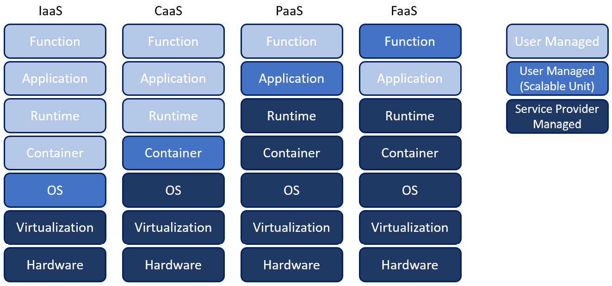

Lets look into details of each:

### 1. GCE (Google Compute Engine) (IaaS):

- GCE is an IaaS offering. It allows the most flexibility as it provides compute infrastructure to provision VM instances.
- This means that you have control of the virtualized hardware and operating system.
- Note, this can be limited to available machine types. You can use standard GCP images or your own custom image.
- You can control where your VMs and storage are located in terms of regions and zones.
- You have granular control over the network, including firewalls and load balancing.
- With the use of an instance group, you can autoscale your control and your capacity as needed.
- Compute Engine is suitable in most cases but might not be an optimal solution.

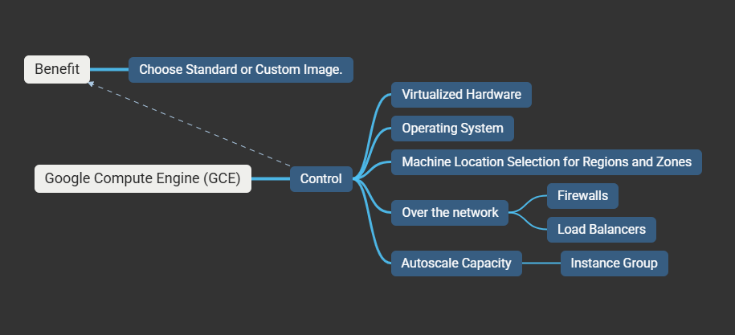

### 2. GKE (Google Kubernetes Engine) (CaaS):

- It allows you to create Kubernetes clusters on demand, which takes away all of the heavy lifting of installing the clusters yourself.
- It leverages Compute Engine for hosting the cluster nodes, but the customer does not need to bother with the infrastructure and can concentrate on writing the code.
- The provisioned cluster can be automatically updated and scaled.
- The GCP software-defined networks are integrated with GKE and allow users to create network objects, such as load balancers, on demand when the application is deployed.
- Several services integrate with GKE, such as Artifact Registry, which allows you to store and scan your container images.

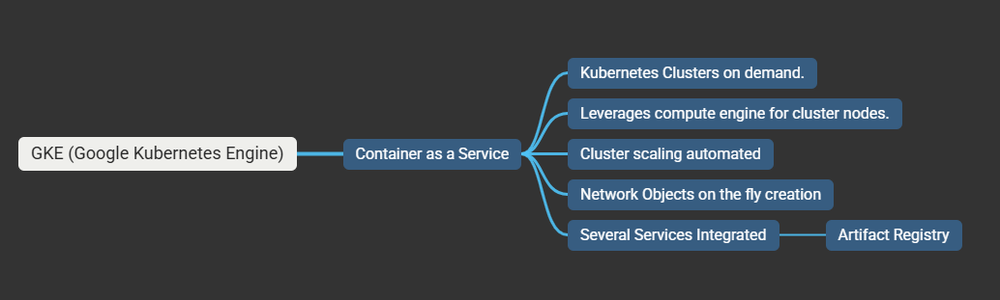

### 3. App Engine (PaaS):

- It allows you to concentrate on writing your code, while Google takes care of hosting, scaling, monitoring, and updates.
- It is targeted at developers who do not need to understand the complexity of the infrastructure.
- GAE is tightly integrated with GCP services, including databases and storage. It allows versioning of your application for easy rollouts and rollbacks.

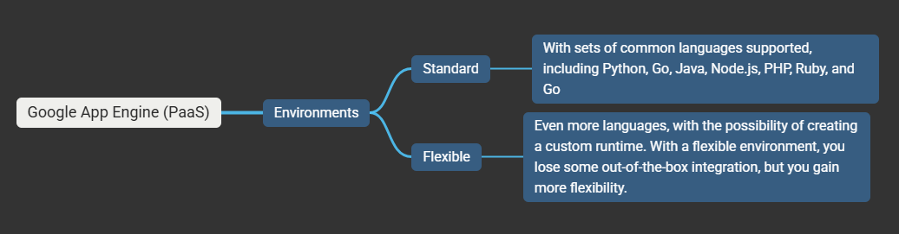

### 4. Cloud Functions (FaaS):

- It allows you to concentrate on writing your functions in one of the supported languages.
- It is ideal for executing simple tasks for data processing, mobile backends, and IoT.
- This service is completely serverless and all of the layers below it are managed by Google.
- The functions can be executed using an event trigger or HTTP endpoint.

### 5. Cloud Run (FaaS):

- Brings together the simplicity of FaaS and portability of CaaS.
- It allows you to develop and deploy self-scaling containerized applications on a fully managed serverless platform.
- It is compatible with Knative so you can move your workloads to any environment that can run Kubernetes in the cloud or on-premises.

### 6. Anthos

- Anthos is a modern application management platform that provides a consistent development and operations experience for cloud and on-premises environments.
- Anthos is not a compute option itself but allows you to run Google Kubernetes Engine and Cloud Run on Anthos in multi-cloud and hybrid environments.

### 7. Google Cloud VMWare Engine (GCVE):

- It is a fully managed native VMware Cloud Foundation software stack hosted in GCP.
- It allows you to accelerate the move to GCP by lifting and shifting your VMs hosted on vSphere into Google Cloud as is.

---

# Google Cloud Storage Services.

- Storage is an essential part of cloud computing as it saves the data and state of your applications.
- GCP offers a wide variety of storage, from object storage to managed databases.

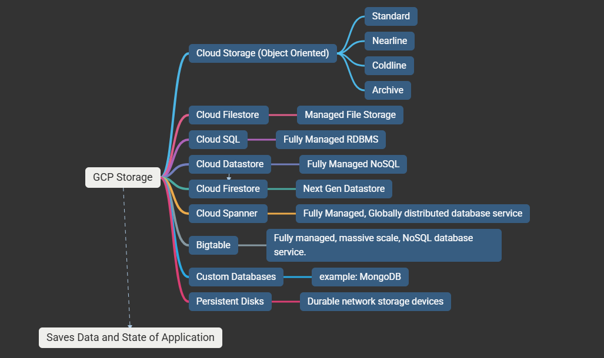

### 1. Cloud Storage (Fully Managed, Object oriented storage):

- It has virtually infinite capacity.
- It allows the creation of buckets that store your data and allow access through APIs and tools such as gsutil.
- It has different storage classes and price differs for each tier.
- Making a conscious decision will allow you to cut costs.
- With Cloud Storage, you do not need to worry about running out of capacity.

### 2. Cloud Filestore (Managed file storage service)

- It allows users to provision a Network Attached Storage (NAS) service that can be integrated with GCE and GKE.
- Google Cloud Filestore offers several performance tiers, including Basic, High Scale, Zonal, and Enterprise/Regional.
- Each designed for different workloads and requirements, from economical file sharing to high-performance computing and mission-critical applications.
- These tiers vary in capacity, performance (like IOPS and throughput), and availability, with options for both HDD and SSD storage to balance cost and speed.

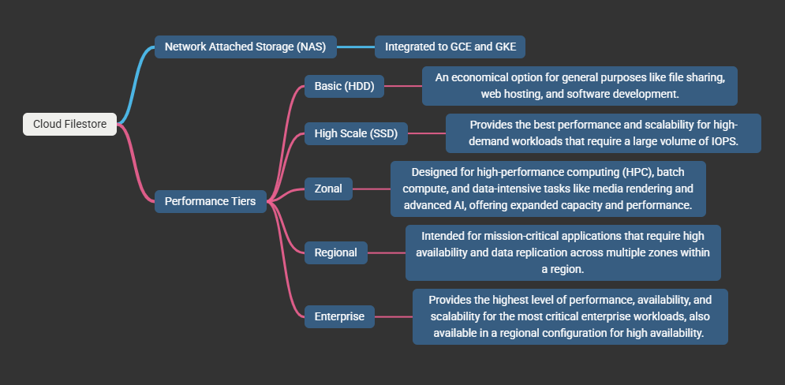

### 3. Cloud SQL (Fully-managed RDBMS)

- Cloud SQL is a fully-managed relational database service for either a MySQL, PostgreSQL, or SQL Server database.
- It offers data replication, backups, data exports, and monitoring.
- It is ideal when you need to move your current instances from on-premises and want to delegate the maintenance of the database to Google.

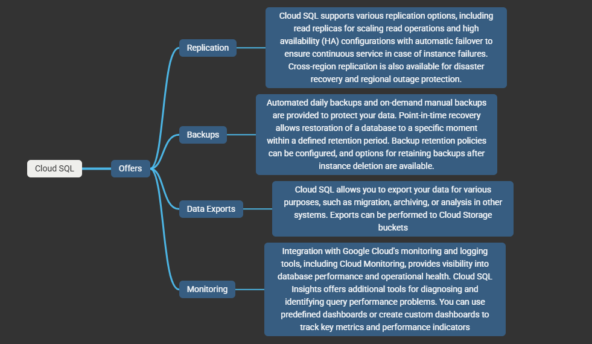

### 4. Cloud Datastore (Fully managed, NoSQL database)

- It is ideal for applications that rely on highly available structured data at scale.
- The scaling and high availability are achieved with a distributed architecture and are abstracted from the user.
- There is only one database available per project.
- Cloud Datastore offers SQL-like language to query your data. It has been superseded by Cloud Firestore.

### 5. Cloud Firestore (Next Gen Cloud Datastore):

- It can run in Native or Datastore mode.
- Google has already started moving all Datastore clients to Cloud Firestore without any downtime or any user intervention.
- All new projects should be created in Cloud Firestore instead of Datastore.

### 6. Cloud Spanner (Fully managed, globally distributed database service)

- It offers the strong consistency of a relational database with non-relational database scaling capabilities.
- Users can define a schema and leverage industry-standard American National Standards Institute (ANSI) 2011 SQL.
- It delivers high-performance transactions, with a 99.999% availability Service-Level Agreement (SLA), meaning there is almost no downtime.
- Cloud Spanner is aimed at use cases such as financial trading, insurance, global call centers, telecoms, gaming, and e-commerce.
- Global consistency makes it ideal for globally accessible applications.

### 7. Bigtable (Fully managed, massive scale, NoSQL database service):

- It is NoSQL, consistent sub-10ms latency for large analytical and operational workloads.
- It is used by Google to deliver services such as Gmail and Google Maps.
- It is ideal for fintech, IoT, and ML storage use cases.
- It integrates easily with big data product families such as Dataproc and Dataflow.
- It is based on open source Apache HBase, enabling the use of its API.
- The cost of Bigtable is much higher than Datastore, so the database should be chosen with great care.

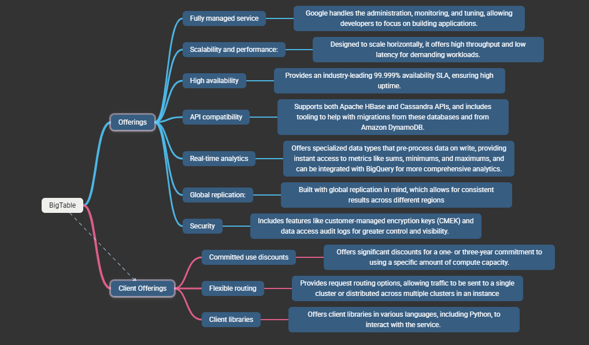

### 8. Custom Databases (Using Compute Engine)

- Choose Compute Engine to install custom databases.
- eg. MongoDB, CouchDB etc.

### 9. Persistent Disk

- There are durable network storage devices hat can be accessed by our instances as if they were physical disks.
- They are located independently from our VM instances and can be detached and moved to keep data safe even after a VM is deleted.

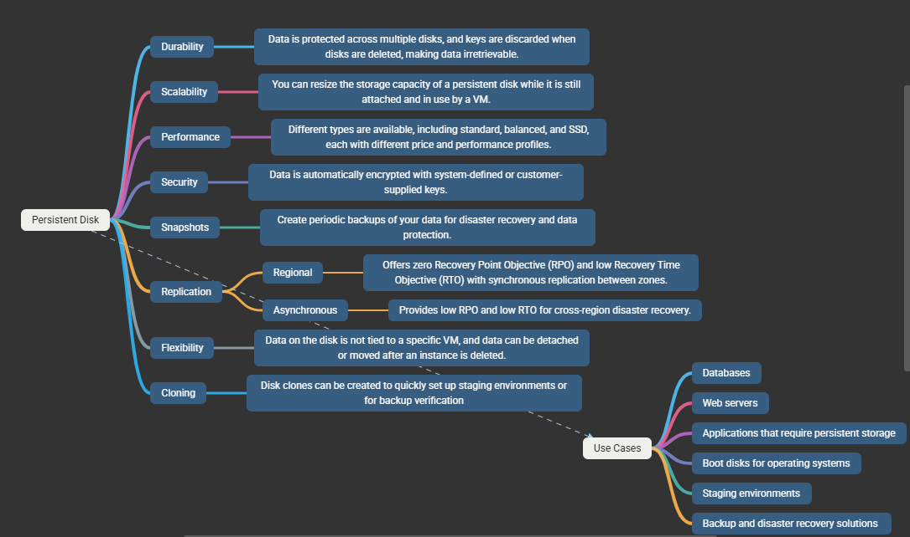

---

# GCP Networking Services.

- GCP networking is based on Software-Defined Networks (SDNs). which allow users to deliver all networking services programmatically.
- All of the services are fully managed, leaving users with the task of configuring them according to their requirements.

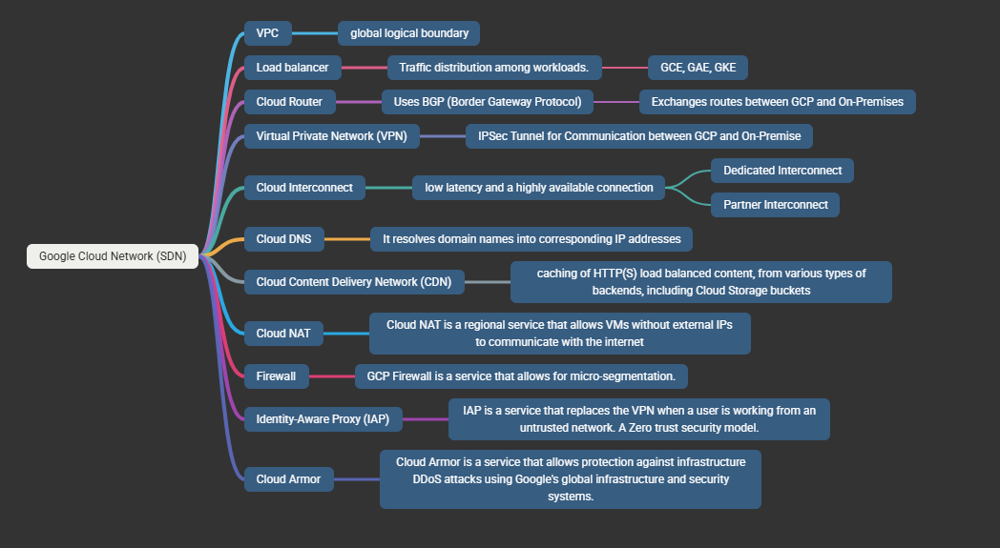

### 1. VPC (Virtual Private Cloud):

- You can think of it as a cloud version of a physical network.
- Each VPC network can contain one or more regional subnets.
- A VPC creates a global logical boundary that allows communication between resources within the same VPC network, subject to applicable network firewall rules.
- To allow communication between VPCs, traffic needs to traverse the internet or use VPC peering.

### 2. Load Balancer (Traffic Distributor)

- A load balancer allows the distribution of traffic between your workloads.
- They are available for GCE, GAE, and GKE.
- For GCE, you can choose from load balancers with global or regional scopes.

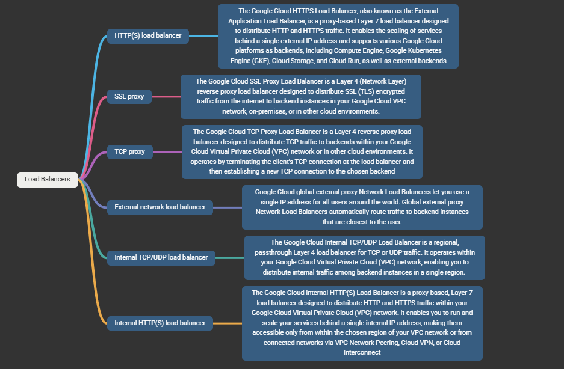

### 3. Cloud Router (Dynamically exchange routes)

- Cloud Router is a service that allows you to dynamically exchange routes between VPC and on-premises networks by using Border Gateway Protocol (BGP).
- It eliminates the need for the creation of static routes.

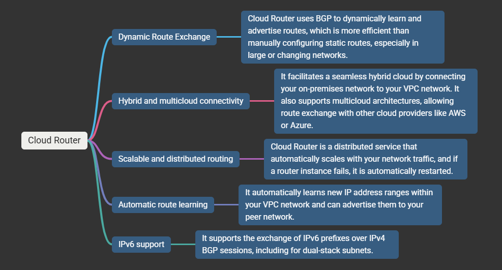

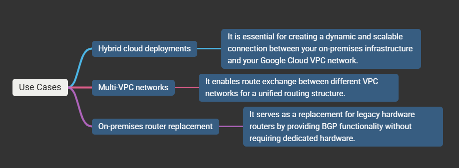

### 4. Virtual Private Network (VPN)

- VPNs allow a connection between your on-premises network and GCP VPC through an IPsec tunnel over the internet.
- Only site-to-site VPNs are supported.
- Traffic in transit is encrypted.
- Both static and dynamic routing are supported, with the latter requiring a cloud router.
- Using a VPN should be considered an initial method of connecting your environment to GCP as it entails the lowest cost.
- If there are low-latency, high-reliability, and high-bandwidth requirements, then Cloud Interconnect should be considered.

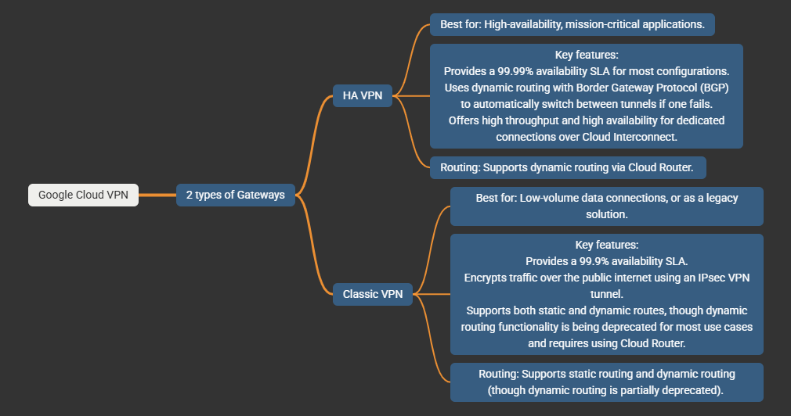

- For new deployments and high-availability needs, choose HA VPN. It is the modern, high-performance option for most scenarios.
- Consider Classic VPN only for existing setups or for low-volume, non-critical connections. For new projects, HA VPN is the recommended choice.

### 5. Cloud Interconnect

- Google Cloud's Interconnect offerings are solutions for connecting on-premises networks to Google Cloud.

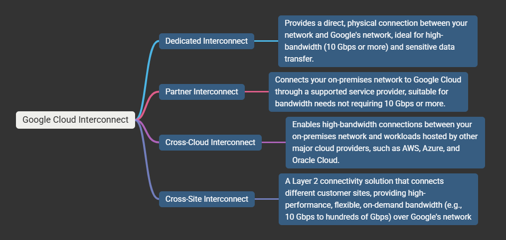

| Feature      | Google Cloud Interconnect                                                                                                                                        | Google Cloud VPN (HA VPN)                                                                                                 |
| ------------ | ---------------------------------------------------------------------------------------------------------------------------------------------------------------- | ------------------------------------------------------------------------------------------------------------------------- |
| Connectivity | Private, dedicated physical connection or through a partner network.                                                                                             | Encrypted IPsec tunnel over the public internet.                                                                          |
| Performance  | High and consistent bandwidth (10 Gbps to 100 Gbps for Dedicated Interconnect) and low latency.                                                                  | Lower and variable bandwidth (up to 1.5-3.0 Gbps per tunnel), subject to internet performance and latency.                |
| Security     | Traffic is not encrypted by default but travels over a private link. Encryption can be added using HA VPN over Interconnect or MACsec.                           | Traffic is encrypted by default using industry-standard IPsec protocols.                                                  |
| Setup        | More complex, requires physical presence in a colocation facility or working with a service provider.                                                            | Easier and faster to set up, only requires a compatible on-premises VPN gateway device.                                   |
| Cost         | Higher setup and ongoing costs, but can reduce overall egress data transfer costs for high-volume traffic.                                                       | Generally more cost-effective for lower-volume needs.                                                                     |
| SLA          | Offers an end-to-end Service Level Agreement (SLA) for connectivity.                                                                                             | Offers a 99.99% availability SLA for the gateway but does not provide an SLA for the underlying internet path.            |
| Use Case     | Ideal for enterprise-grade, production-level applications, large-scale data transfers, and hybrid cloud environments requiring high performance and reliability. | Suitable for low-volume data connections, non-critical applications, or as a cost-effective, quick-to-implement solution. |

---

### 6. Cloud DNS

- A global network with high availability, security features like DNSSEC, private DNS for internal networks, and integration with other Google Cloud services like GKE, Cloud IAM, and Cloud Logging.

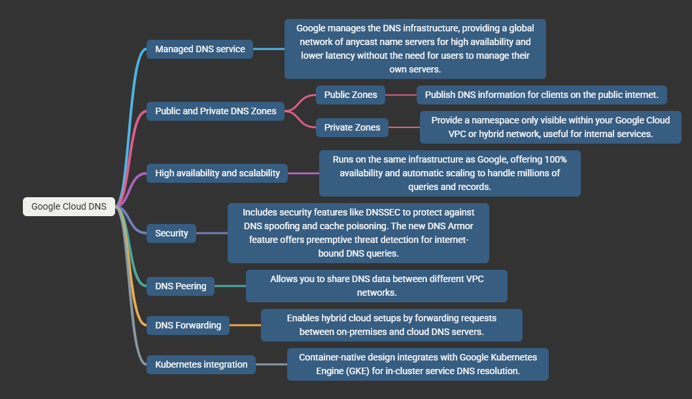

### 7. Google Cloud CDN (Content Delivery Network)

- A global edge network for fast content delivery, integration with Google's premium network, security features like DDoS protection and SSL termination, and flexible caching with support for dynamic content.

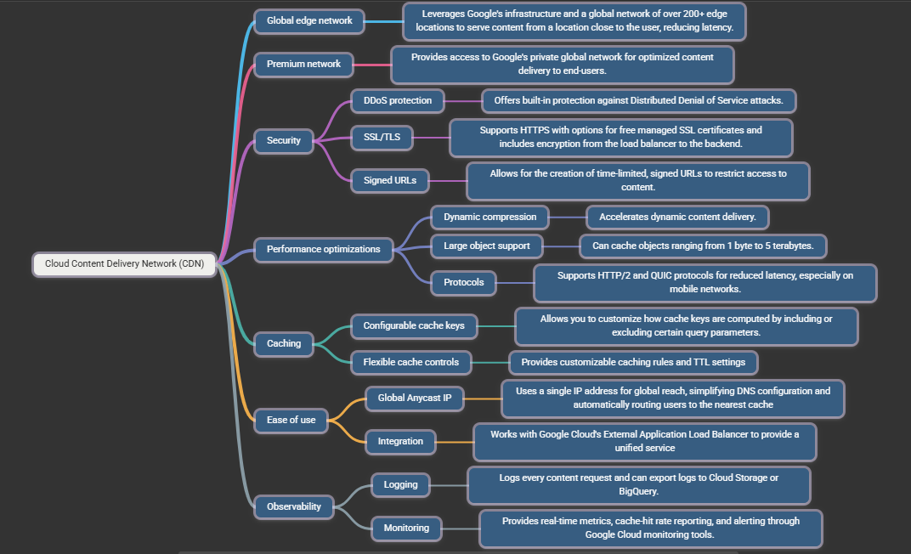

- Cloud CDN is a service that allows the caching of HTTP(S) load balanced content, from various types of backends, including Cloud Storage buckets.
- Caching reduces content delivery time and cost. It can also protect you from a Distributed Denial-of-Service (DDoS) attack.
- Data is cached on Google's globally distributed edge points. On the first request, when content is not cached, data is retrieved from a backend origin.
- The subsequent requests for the same data will be served directly from the cache until the expiration time is reached.

### 8. Google Cloud NAT (Proxy Less)

- A fully managed, proxy-less, and scalable service that allows private Google Cloud workloads, such as Compute Engine VMs and private GKE clusters, to access the internet for egress traffic without needing external IP addresses.

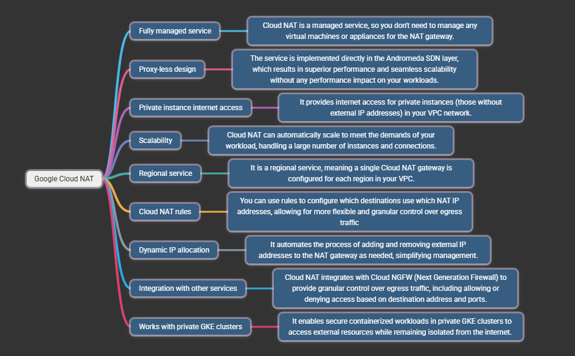

### 9. Firewall (Latest includes, Next Generation Firewall)

#### 1. Google Cloud Firewall: ((VPC Firewall Rules))

- These are the default or built-in firewalls for any Virtual Private Cloud (VPC) in GCP.
- Purpose: To control traffic to and from your VM instances or services inside a VPC.

🔹 Key Characteristics:

- Stateful: If you allow incoming traffic, the response traffic is automatically allowed.
- Applied at instance level: Each VM instance has firewall rules applied to it based on its network tags or service accounts.
- Default rules: GCP creates default rules (like allowing internal communication and blocking all inbound external traffic).
- Direction: Rules can apply to Ingress (incoming traffic) or Egress (outgoing traffic).
- Priority system: Lower number = higher priority.

🔹 Example:

- Ingress: Allow TCP port 22 (SSH) from your IP.
- Egress: Allow all traffic to the internet.

---

🚀 2. Google Cloud Next Generation Firewall (NGFW):

This is a more advanced version of the traditional firewall — recently introduced by Google Cloud to provide application-level protection, not just port/IP-based filtering.

🔹 Purpose:

- To protect workloads against modern threats (malware, intrusion attempts, malicious URLs, etc.) using deep packet inspection (DPI) and threat intelligence.

🔹 Key Features:

- Layer 7 (Application Layer) protection — inspects application-level data.
- Threat intelligence-based blocking — uses Google’s threat database.
- URL filtering & application awareness — can allow or deny traffic based on the actual app (e.g., block Facebook, allow Google Drive).
- Intrusion prevention system (IPS) — detects and blocks malicious patterns.
- Centralized management — works with Cloud Armor, Security Command Center, and Network Security.

🔹 Types:

- Cloud NGFW for VPC: Manages network-based security within VPCs.
- Cloud NGFW for Hybrid/Edge: For on-prem or hybrid setups.

---

⚙️ 3. Comparison – Classic vs Next-Gen Firewall

| Feature              | Google Cloud VPC Firewall   | Google Cloud Next Generation Firewall              |
| -------------------- | --------------------------- | -------------------------------------------------- |
| **Layer**            | Network Layer (Layer 3/4)   | Application Layer (Layer 7)                        |
| **Control Type**     | IPs, ports, protocols       | Apps, URLs, content, threats                       |
| **Use Case**         | Basic access control        | Advanced threat prevention                         |
| **Example Rule**     | Allow TCP 80 from 0.0.0.0/0 | Allow HTTP traffic but block known malicious sites |
| **Integration**      | Built into VPC              | Part of Network Security suite                     |
| **Threat Detection** | No                          | Yes (DPI, IPS, threat feeds)                       |

---

### 10. Identity Aware Proxy (IAP)

- IAP is a service that replaces the VPN when a user is working from an untrusted network.
- It controls access to your application based on user identity, device status, and IP address.
- It provides provides a central authorization layer to control access to web applications and cloud resources using a zero-trust security model.

- IAP Access Control for various resources:

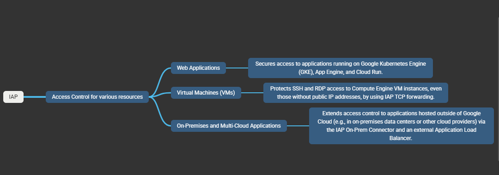

- IAP Features and Capabilities:

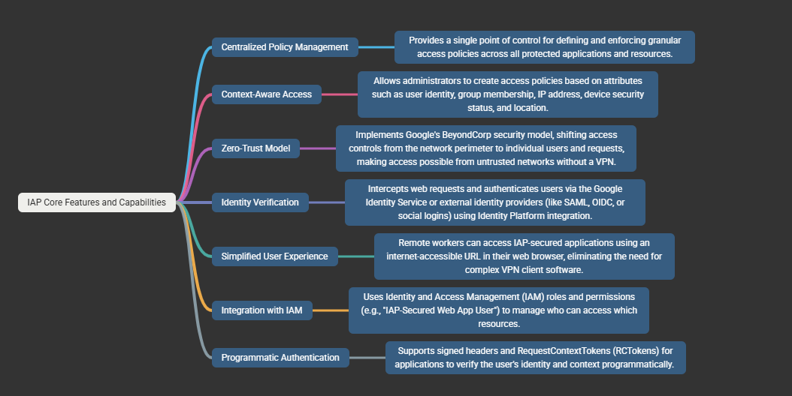

### 11. Cloud Armor

- Cloud Armor is a service that allows protection against infrastructure DDoS attacks using Google's global infrastructure and security systems.
- It integrates with global HTTP(S) load balancers and blocks traffic based on IP addresses or ranges.
- The preview mode allows users to analyze the attack pattern without cutting off regular users.

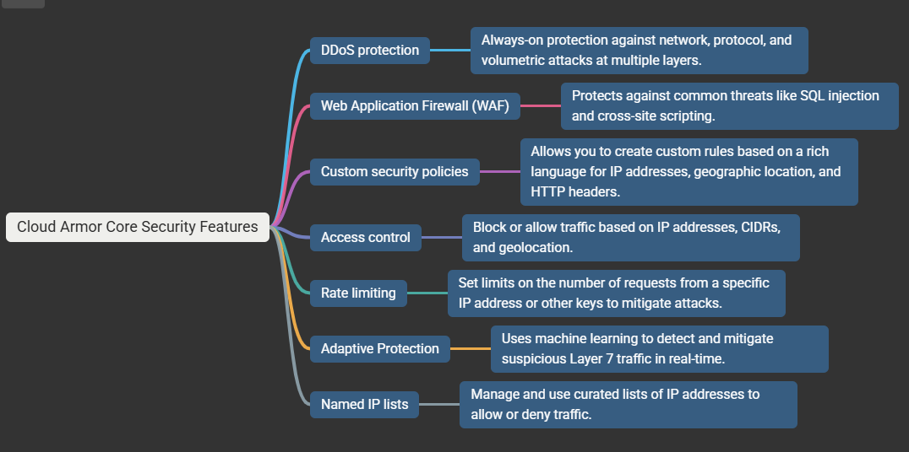

---

---

# BIG Data Services

- Big data services enable the user to process large amounts of data to provide answers to complex problems.
- GCP offers many services that tightly integrate to create an End-to-End (E2E) data analysis pipeline.

### 1. BigQuery

- BigQuery is a highly scalable and fully managed cloud data warehouse. It allows users to perform analytics operations with built-in ML.
- BigQuery is completely serverless and can host petabytes of data.
- The underlying infrastructure scales seamlessly and allows parallel data processing. The data can be stored in BigQuery Storage, Cloud Storage, Bigtable, Sheets, or Google Drive.
- The user defines datasets containing tables. BigQuery uses familiar ANSI-compliant SQL for queries and provides ODBC and JDBC drivers.
- Users can choose from two types of payment models—one is flexible and involves paying for storage and queries, and the other involves a flat rate with stable monthly costs.
- It is ideal for use cases such as predictive analysis, IoT, and log analysis, and integrates with GCP's big data product family.

#### BigQuery Core Services:

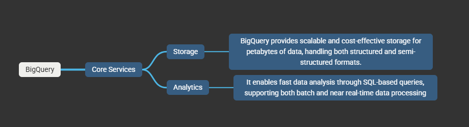

#### BigQuery Features:

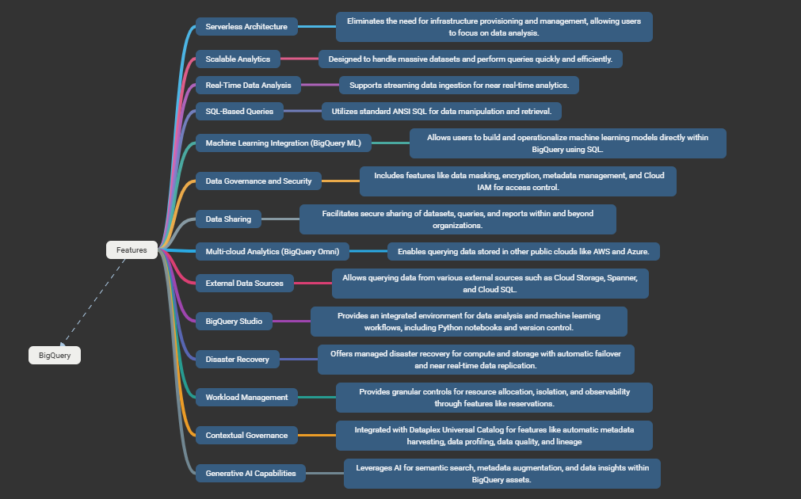

### 2. Pub/Sub

- This is a fully managed asynchronous messaging service that allows you to loosely couple your application components.
- It is serverless with global availability.
- Your application can publish messages to a topic or subscribe to it to pull messages. Pub/Sub also offers push-based delivery of messages as HTTP POST requests to Webhooks.

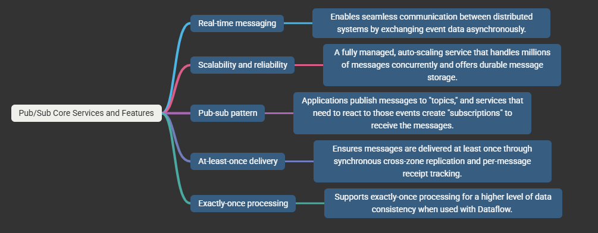

#### Pub/Sub Functionalities

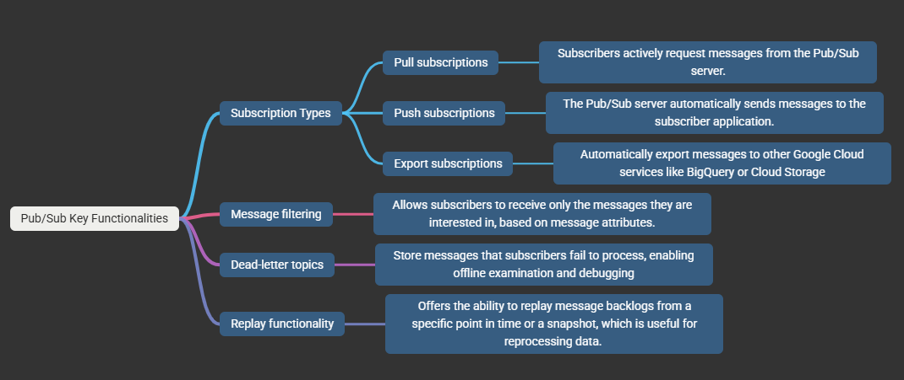

#### Pub/Sub Lite

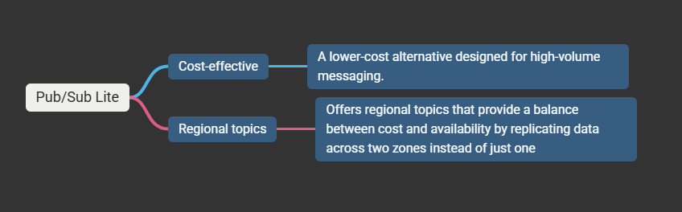

### 3. Dataproc

- Google Cloud Dataproc is a fully managed, scalable service for running open-source big data frameworks like Apache Spark and Hadoop on Google Cloud.
- Its offerings include creating and managing clusters for batch processing, ETL, and analytics, with features like automatic cluster scaling, dynamic scaling during job execution, integration with other Google Cloud services (such as Vertex AI and Cloud Composer), and optimized performance through features like Lightning Engine.

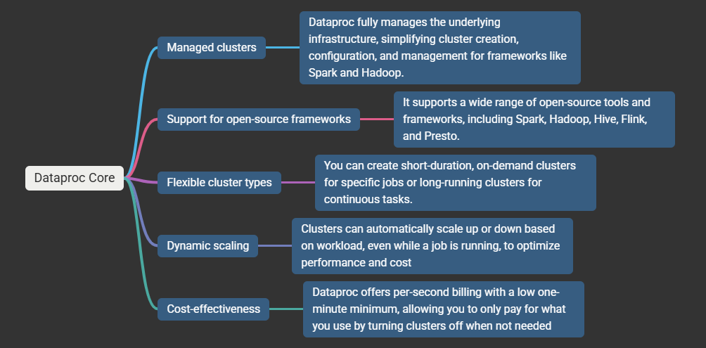

#### Dataproc Key Features

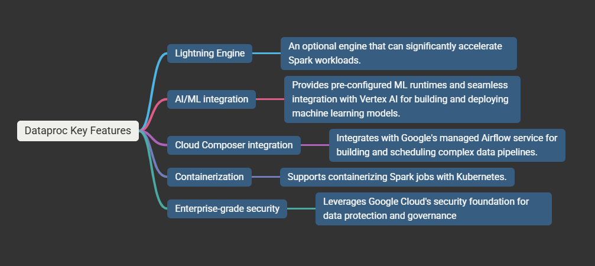

### 4. Cloud Dataflow

- Google Cloud Dataflow is a fully managed service for running unified stream and batch data processing pipelines, based on the open-source Apache Beam SDK
- Its offerings include a serverless, autoscaling execution environment, a wide range of integrations with other Google Cloud services like BigQuery, Cloud Pub/Sub, and Cloud Storage, and tools for monitoring, debugging, and creating pipelines through templates or the Job Builder.

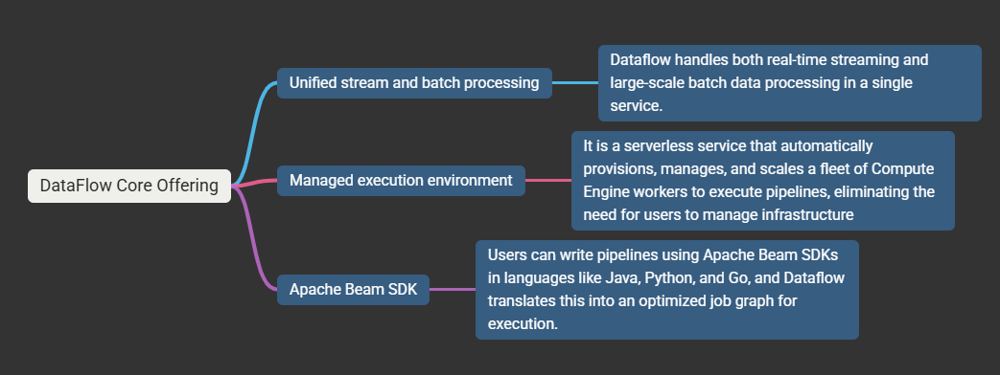

#### Dataflow Key Features

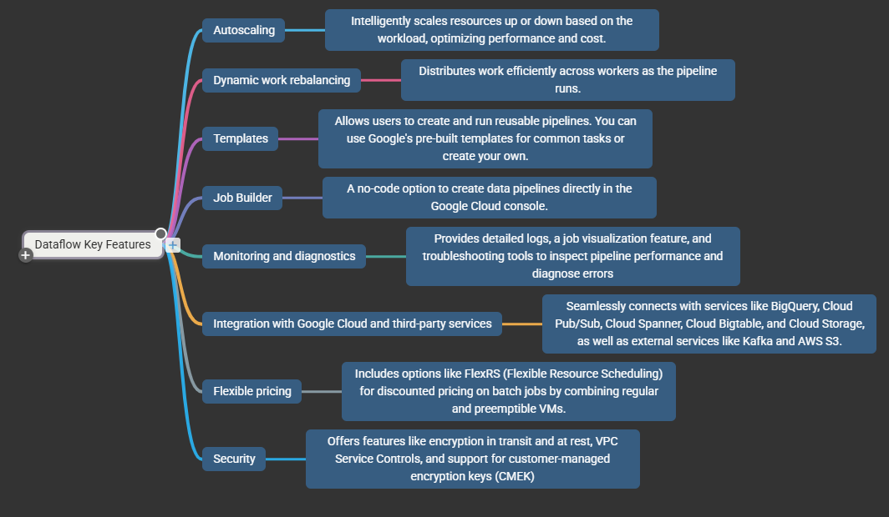

### 5. Dataprep

- This is a tool that can be used to perform data preparation and visualization.
- We can explore and transform data without any coding skills being required.
- Data can be interactively prepared for further analysis.

#### Dataprep features

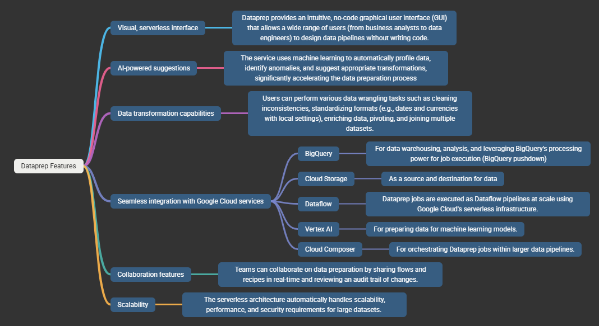

### 6. Datalab

- Datalab is a tool built into Jupyter (formerly IPython) that allows users to explore, analyze, and transform data. It also allows users to build ML data models and leverages Compute Engine.

### 7. Data Studio

- This is a tool that allows you to consume data from sources and visualize it in the form of reports and dashboards.

### 8. Cloud Composer

- This is a fully managed service based on open source Apache Airflow.
- It allows you to create and orchestrate big data pipelines.

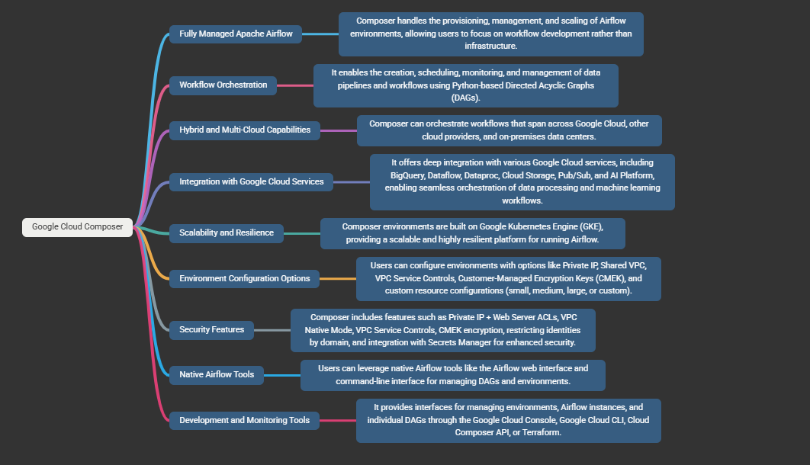

### 9. Data Fusion

- This is a fully managed enterprise data integration service.
- It provides a UI that allows you to build and manage pipelines to clean, prepare, blend, transfer, and transform data.

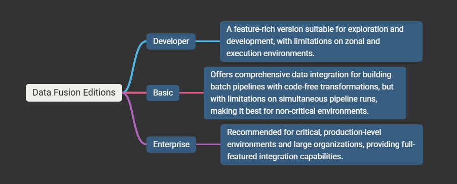

#### Data Fusion Features

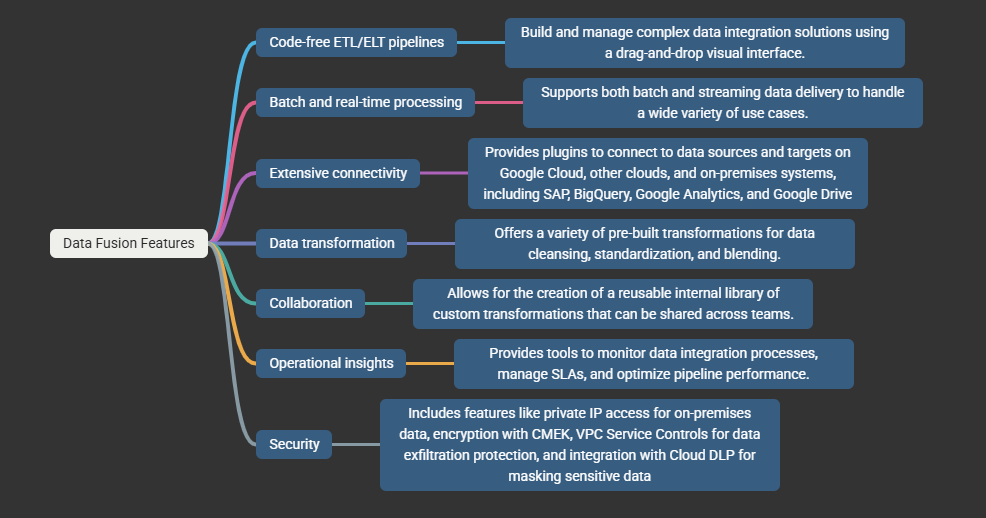

---

# Machine Learning Services

- One of the strongest points of Google is its long-term experience with Machine Learning (ML). GCP offers several services around ML. You can choose between a pre-trained model or train a model yourself. The various services included under ML are as follows

1. Pretrained APIs
2. AutoML
3. Dialogflow
4. AI Platform
5. Vertex AI

# Pretrained APIs : ML APIs are services that allow you to leverage several pre-trained models, enabling you to analyze a video.

- Google Cloud Video Intelligence
- Google Cloud Speech
- Google Cloud Vision
- Google Cloud Natural Language
- Google Cloud Translation
- Google Recommendations AI

### 1. AutoML

- AutoML is a service that can be used by developers to train models without having extensive knowledge of data science.
- As an example, by providing labeled samples to AutoML, it can be trained to recognize objects that are not recognizable by the Vision API.
- The labeled samples of AutoML are as follows:
- AutoML Translation
- AutoML Natural Language
- Video Intelligence
- AutoML Tables

### 2. Dialogflow

- This is a service that allows you to build conversation applications that can interact with human beings.
- The interface can interact with many compatible platforms, such as Slack or Google Assistant.
- It can also integrate with Firebase functions to integrate with third-party platforms using common APIs.

### 3. AI Platform

- This was a fully managed service to allow the E2E development of a machine learning model.
- Before it went to general availability, Google released Vertex AI and deprecated AI Platform.

### 4. Vertex AI

- This is a unified machine learning platform to build, deploy, and scale AI models.
- It integrates AutoML and AI Platform together into a unified API, client library, and user interface.
- With Vertex AI, you can perform both AutoML training and custom training. For both of those options, you can save models, deploy models, and request predictions using Vertex AI.

---

# Identity and Access Management (IAM) Services:

- Identity and Access Management (IAM) is one of the most important aspects of any cloud. It allows you to control who has access to the cloud but can also provide identity services to your applications.
- In short, this is achieved by a combination of roles and permissions. The roles are assigned to either users or groups.

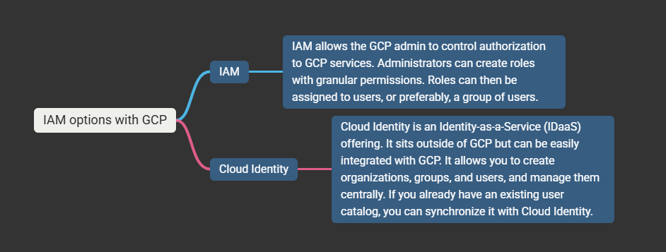
