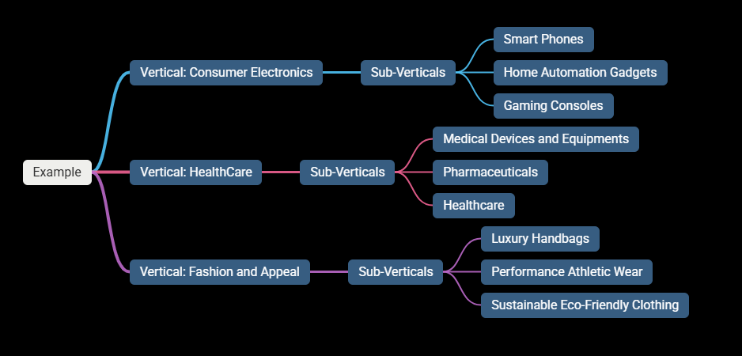
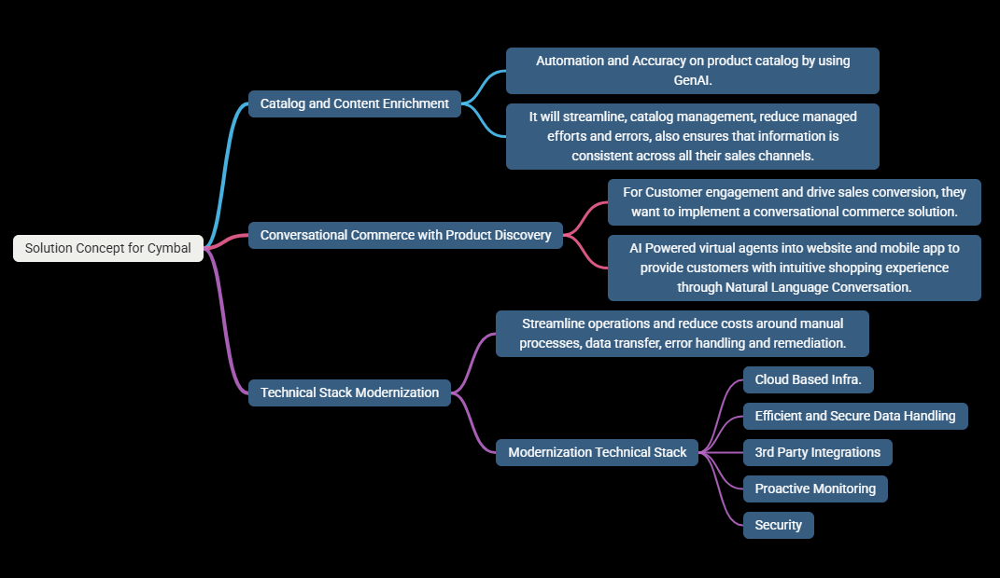
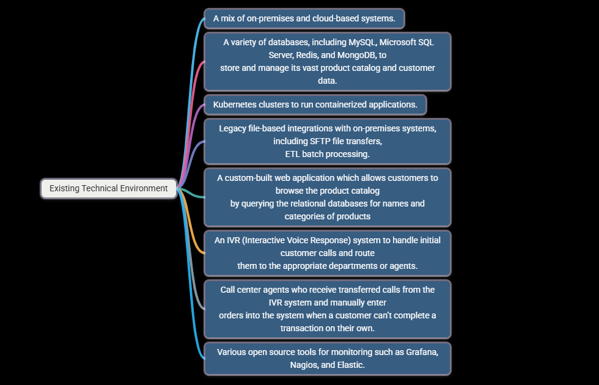
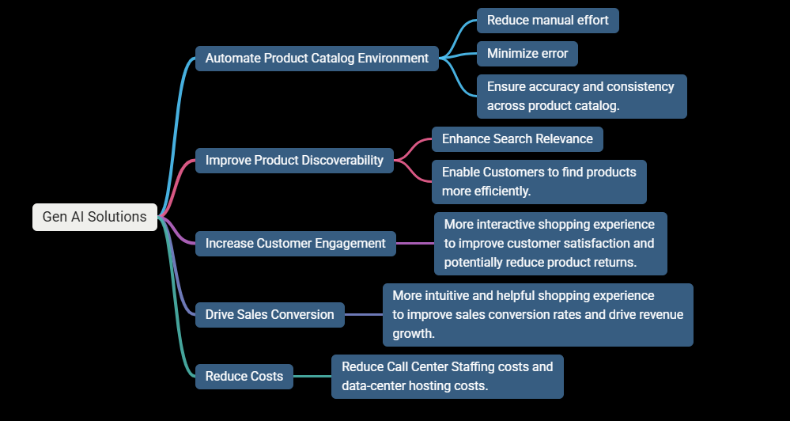
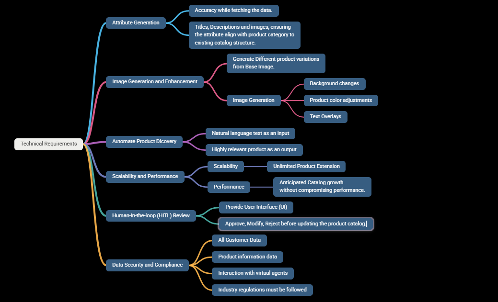
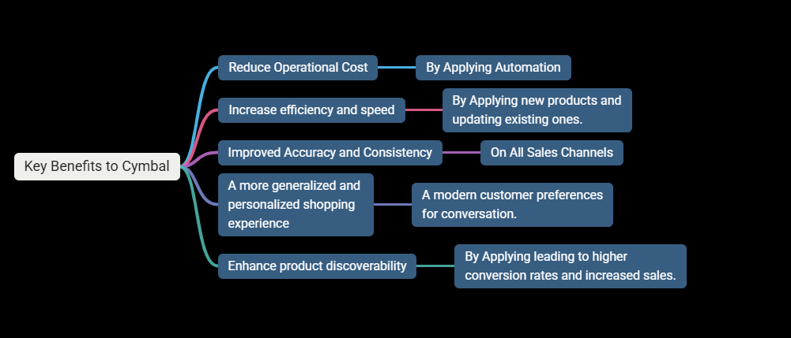

# Cymbal Retail Case Study

## Cymbal is a retailer company and having a website with assorted product catalog along with sub-verticals.

### What is Sub-Verticals list of product?

### A sub-vertical list of products refers to a highly specific, granular category of products within a broader industry vertical or niche market. This segmentation allows businesses to target a very specific audience with highly customized solutions and expertise.

# Solution Concept (High-Level Overview)

### Focus on what to achieve: It define outcomes and capabilities that will address the core problems outlined in case-study.

### Cymbal wants to modernize their application and enhance the customer experience by achieving the following 3 core areas.

## Current Technical Environment Challenges

### 1. Manual processes are time consuming and error-prone.

### 2. Data silos limit a unified view of the cusomer journey.

### 3. Integration with new technology is difficult.

## Current Technical Stack

# Business Requirements (outline: Description about the most important facts.)

### Key Business Requirements.

### Technical Requirements

# Executive Statement (OR Summary)

### A brief standalone overivew of the entire project designed for high-level stakeholders, such as executives and investors

## Transformation needed for Cymbal

### 1. Improve Efficiency

### 2. Enhance Customer Experience

### 3. Drive Revenue Growth

