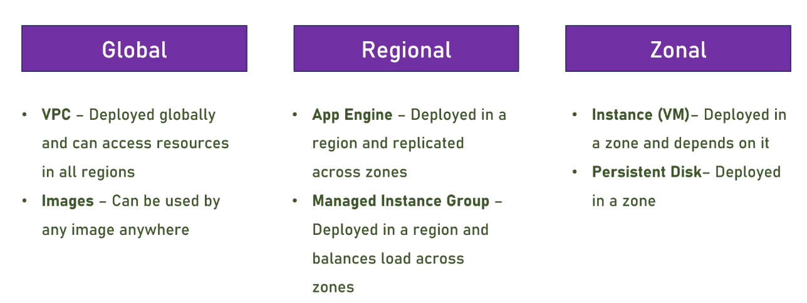
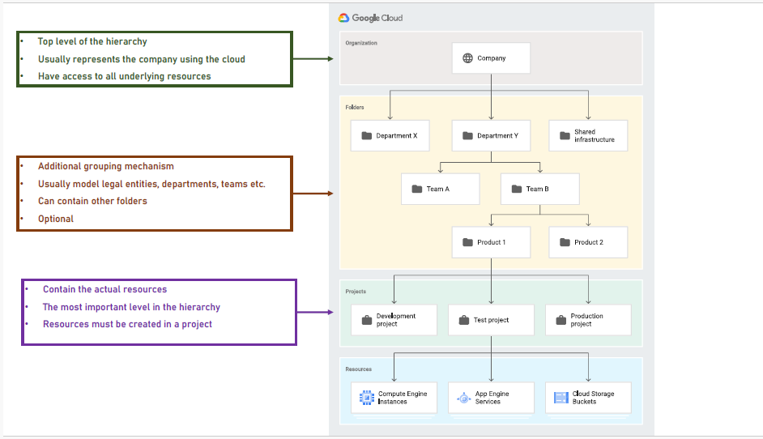

# Regions and Zones

## Regions

- Google built a lot of Datacenters for GCP
- Datacenters are grouped into Geographic Locations
- Each such location is called Region
- There are more than 40+ GCP regions
- Almost every new resource in the cloud should be allocated to a region.

## Zones

- Regions have more than one physical data centers, usually three.
- Great for availability when datacenter fails.
- Each datacenter is called Zone
- Some cloud services take advantage of multiple zones in a region.

---

# Region selection considerations

- When selecting a region for your cloud services consider the followings:

### 1. Service Availability :

Not all services are available in all regions.

### 2. Proximity :

Select the regions that is nearest to your Audience.

### 3. Price :

Services prices are varies between regions.

---

- The Google has the low emission regions (that is carbon-free cloud)
- Depends on the Electricity in the specific region.
- Regions with low emission marked with Low Co2 Icon.

---

# Global, Regional and Zonal Services

- Cloud services are placed in a region, zone or globally
- Determine their level of isolation and availability

### For example :

- Regional services are placed in a region, zone or globally.
- Zonal services are depend upone their zone, and access only services in the same zone
- Global services are available into the entire cloud and it has no specific boundries.

---

# GCP Hierarchy

