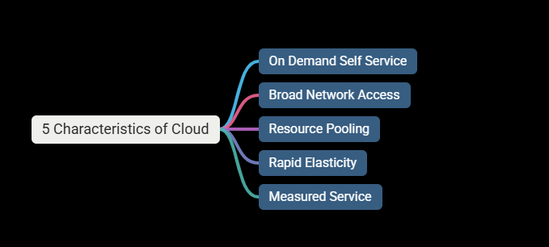
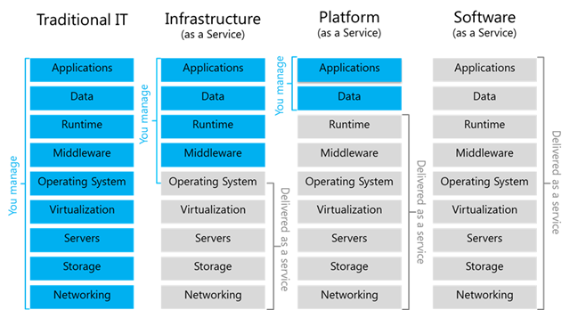

# Introduction to cloud computing

## The characterstics of the cloud

### 1. On Demand Self Service

- No human interaction is needed for resource provisioning
- Resource can be provisioned (or created) with a click of a button.
- Provisioning is available 24/7 (Everything is automated)

### 2. Broad Network Access

- Resources can be accessed from anywhere using the network.
- Ideally high broadband (for e.g I can create the VM machine in the USA while residing in India)
- No physical access is required at any time.

## 3. Resource Pooling

- Physical resources are shared between customers.
- The cloud's backbone decides which physical resource to allocate for customer's virtual services. (Resources are dynamically decided by the cloud backbone services and it is completely abstract from the customer for resource exact location)
- Some advanced cloud services allow for physical resource separation.

## 4. Rapid Elasticity

- Resources can be scaled up and down as needed, automatically.
- No need to purchase resources for a one-time peak scenario.

## 5. Measured Service

- Payment is done only for the resources actually used.
- Server time / DB storage / Function calls etc.
- Measurement usually done in high resolution
  - for example Server time is measured by seconds.
- No need to invest money in non-used resources.

---

---

# CapEx (Capital Expense) v/s OpEx (Operating Expense)

### CapEx

- Making upfront investment for future use/profit.
- Traditional IT is CapEx oriented and measurely investment done for

  - Building Data Centers
  - Purchasing Servers
  - Purchasing Air Conditioning
  - Purchasing network devices
  - Purchasing software licenses (DB etc.)
    There are some OpEx involved in Traditional IT too as follows:
  - Electricity
  - Salaries
  - Maintenance (By hiring people for different departments)

- CapEx is non optimal and non flexible.

### OpEx

- Pay for what you actually use.
- Extremly flexible
- Most Optimal
- This is basically used in the Cloud.

---

---

# Types of Cloud Services

### The 3 most common types are IaaS, PaaS, SaaS

## 1. IaaS (Infrastructure as a service)

- The cloud provides the underlying platform.
  - Compute
  - Networking
  - Storage
- The client is responsible for all the rest.
- for e.g The Virtual Machines
- The cloud provides the host machine, networking and disks.
- The client creates the virtual (guest) machine, installs software on it, patches it and maintains it etc.
- It is the clients responsibility to keep up and running the Virtual Machine and it is not the Cloud's responsibility.

## 2. PaaS (Platform as a Service)

- The cloud provides platform for the running apps.
- The cloud provides:
  - Compute
  - Networking
  - Storage
  - Runtime environment
  - Scaling
  - Redundency
  - Security
  - Updates
  - Patching
  - Maintenance and etc.
- The client just need to bring the code to run.
- The most common example of PaaS is Web Apps.
- With Web Apps the cloud provide the runtime for running web apps.
- The client only uploads the code, and it just runs.
- The client has no access to underlying Virtual Machines.
- It is the responsibility of the cloud is that App is up and running.

## 3. Saas (Software as a Service)

- A software running completely in the cloud.
- The user doesn't need to install anything on-premises or on his machine.
- The provider of the software takes care of updates, patches, redundency, scalability etc.
- The most common examples are Office 360 or Salesforce.
- The client is unaware of the underlying infrastructure for such services (like what is the virtual machine used, os used or programming language is used.)

  

- There are other Cloud services too
  - Function as a Service (FaaS)
  - Database as a Service (DBaaS)
  - IOT as a Service (IOTaaS)
  - AI as a Service (AIaaS)
- However, the most commonly used Iaas, PaaS and SaaS.

---

---

# Types of Clouds (Public, Private and Hybrid)

### 1. Public Cloud

- The cloud is setup in the public network.
- Managed by large companies. (Google, Microsoft, AWS)
- Accessible through the internet.
- Available to all clients and users.
- Clients have no access to underlying infrastructure.

## 2. Private Cloud

- A cloud setup in an organization's premises.
- It is managed by the organization's IT team.
- Accessible only in the organizations network.
- Available only users from the organizations. (External users are not allowed.)
- Uses private cloud infrastructure and engines.
- Containes usually the subset of the public cloud's capabilities.
  e.g. VMWareCloud, RED HAT Openshift, Azure Stack

## 3. Hybrid Cloud

- A cloud setup in an Organizations premises but it is also connected to the public cloud.
- That is the workload can be separated between the two clouds.
- for e.g Sensitive data in the organization's premises, public data in the public cloud.
- The hybrid cloud is managed by the public cloud, but not always. Or sometimes it is a vice a versa.
- Exmaple: Azure Arc, AWS outposts, inside the Google it is Anthos.
